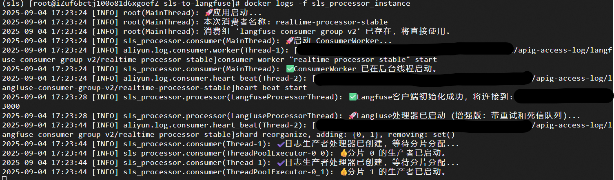
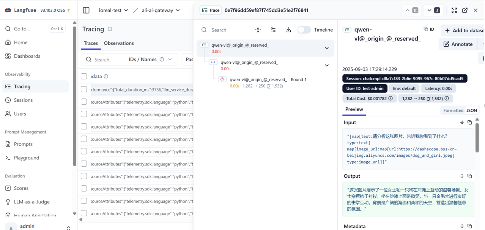

# 阿里云SLS to Langfuse 实时同步服务

<p align="left">
  
  
  
  
</p>

一个高性能的实时数据同步服务，能将阿里云 SLS 中的 AI 网关日志自动解析并发送到 Langfuse，用于 AI 应用的观测和分析。支持docker一键部署和本地测试部署。

## 前置条件

在开始部署前，请务必确保环境满足以下要求。不满足这些条件是导致部署失败的最常见原因。

### 1. AI 网关配置

阿里云 AI 网关**必须**配置为将访问日志输出到阿里云 SLS。日志格式的正确性是服务能否运行的关键。

-   **开启链路追踪 (必须条件)**：网关的追踪或日志记录功能必须处于激活状态。
-   **JSON 日志格式**：日志必须是 JSON 格式，且包含一个名为 `ai_log` 的特定字段，该字段本身也必须是 JSON 字符串。**(注：阿里云AI网关日志默认满足此格式)**
-   **必需字段**：日志条目必须包含以下关键字段。**(注：阿里云AI网关日志默认满足此格式)**
    ```json
    {
      "trace_id": "用于追踪请求的唯一ID",
      "question": "用户的输入或提示",
      "answer": "AI模型的回复",
      "ai_log": "",
      "response_code": 200,
      "duration": 540
    }
    ```

### 2. 基础设施要求

-   **阿里云 SLS**：需要一个已创建的 SLS Project 和 Logstore。
-   **Langfuse 实例**：一个正在运行且可以从外部访问的 Langfuse 服务（自托管或云版本均可）。
-   **Docker 环境**：在服务器上安装 `Docker 20.10+`。
-   **网络连通性**：服务器/容器必须能够访问阿里云 SLS 的 API 端点和 Langfuse 主机。

## 快速开始与部署

### 1. 克隆仓库

```bash
git clone https://github.com/your-username/sls-to-langfuse.git
cd sls-to-langfuse
```

### 2. 配置环境变量
服务完全通过环境变量进行配置。请从示例文件创建一个 `.env` 文件。
```bash
cp .env.example .env
```
然后，编辑 `.env` 文件，填入特定凭证和端点信息。

```bash
# .env

# ======== 阿里云SLS配置 ========
ALIYUN_ENDPOINT=cn-shanghai.log.aliyuncs.com  # 根据SLS所在区域调整
ALIYUN_ACCESS_KEY_ID=YOUR_ACCESS_KEY_ID       # 阿里云 Access Key ID
ALIYUN_ACCESS_KEY_SECRET=YOUR_ACCESS_SECRET   # 阿里云 Access Key Secret
ALIYUN_PROJECT_NAME=your-sls-project-name     # SLS项目名称
ALIYUN_LOGSTORE_NAME=your-logstore-name       # SLS日志库名称
ALIYUN_CONSUMER_GROUP_NAME=langfuse-consumer-prod-v1 # 自定义消费组名称 (请参考下方说明)

# ======== Langfuse 配置 ========
LANGFUSE_HOST=https://your-langfuse-instance.com # Langfuse主机URL
LANGFUSE_PUBLIC_KEY=pk-lf-xxxxxxxxxxxxxxxxxxxx   # Langfuse公钥
LANGFUSE_SECRET_KEY=sk-lf-xxxxxxxxxxxxxxxxxxxx   # Langfuse私钥
LANGFUSE_SDK_TIMEOUT=30                          # SDK超时时间 (秒，可选)

# ======== 应用与日志配置 ========
TZ=Asia/Shanghai          # 设置容器时区，例如 Asia/Shanghai
LOG_FORMAT=json           # 日志格式: 'human' (开发环境) / 'json' (生产环境)
```

### 3. 使用脚本一键部署
项目提供的 `deploy.sh` 脚本可以自动完成拉取最新代码、重建 Docker 镜像以及重启容器的全部流程。
```bash
# 赋予脚本执行权限
chmod +x deploy.sh

# 运行部署脚本
./deploy.sh
```

### 4. 验证服务状态
检查容器的状态和日志，确保服务已正常运行。
```bash
# 检查容器是否正在运行
docker ps | grep sls_processor_instance

# 查看实时日志
docker logs -f sls_processor_instance
```
如果所有配置都正确，应该能看到服务已启动并正在从 SLS 分片中拉取数据的日志。

## Docker 镜像与自定义
### 镜像源说明
> **注意**
> 为了提高国内用户的构建速度，`Dockerfile` 默认使用**华为云镜像源**的 Python 基础镜像。
> ```dockerfile
> FROM swr.cn-north-4.myhuaweicloud.com/ddn-k8s/docker.io/library/python:3.11-slim
> ```
> 如果在海外，或希望使用官方 Docker Hub 镜像源，请修改 `Dockerfile` 文件：
> ```dockerfile
> FROM python:3.11-slim
> ```
> 同样，Python 依赖包默认使用清华 `pip` 镜像源进行安装。如果不需要，可以在 `Dockerfile` 的 `RUN` 命令中移除该配置。

### 自定义构建
如果修改了源代码，可以自行构建和推送镜像：
```bash
# 构建自定义镜像
docker build -t your-registry/sls-to-langfuse:latest .

# 推送到私有镜像仓库
docker push your-registry/sls-to-langfuse:latest
```

## 详细配置说明
### 环境变量

| 变量名                       | 是否必需 | 默认值   | 描述                                                                    |
| ------------------------------ | :------: | :-------: | ----------------------------------------------------------------------- |
| `ALIYUN_ENDPOINT`              |    ✅    |    —    | 所在区域的阿里云 SLS API 端点。                                       |
| `ALIYUN_ACCESS_KEY_ID`         |    ✅    |    —    | 阿里云 Access Key ID。                                              |
| `ALIYUN_ACCESS_KEY_SECRET`     |    ✅    |    —    | 阿里云 Access Key Secret。                                          |
| `ALIYUN_PROJECT_NAME`          |    ✅    |    —    |  SLS 项目名称。                                                     |
| `ALIYUN_LOGSTORE_NAME`         |    ✅    |    —    | 存储网关日志的 SLS 日志库名称。                                         |
| `ALIYUN_CONSUMER_GROUP_NAME`   |    ✅    |    —    | **至关重要**：唯一的消费组名称。请参考下方说明。                        |
| `LANGFUSE_HOST`                |    ✅    |    —    |  Langfuse 实例的完整 URL。                                          |
| `LANGFUSE_PUBLIC_KEY`          |    ✅    |    —    |  Langfuse 项目中的公钥 (Public Key)。                                 |
| `LANGFUSE_SECRET_KEY`          |    ✅    |    —    |  Langfuse 项目中的私钥 (Secret Key)。                                 |
| `LANGFUSE_SDK_TIMEOUT`         |    ❌    |   `30`    | 调用 Langfuse API 的超时时间（秒）。                                    |
| `TZ`                           |    ❌    |   `UTC`   | 容器的时区，以确保日志时间戳正确。                                      |
| `LOG_FORMAT`                   |    ❌    |  `human`  | `human` (易读，用于开发)，`json` (结构化，用于生产)。                  |


> **关于 `ALIYUN_CONSUMER_GROUP_NAME` 的重要说明**
> 这个名称决定了服务从哪里开始读取日志。
> - **使用相同的名称**：服务会从上次消费的位置继续。
> - **更改为新的名称**：服务会**从头开始消费所有日志**，这可能导致大量数据在 Langfuse 中重复。
> 
> 建议为不同环境使用不同的名称（例如 `langfuse-consumer-dev`, `langfuse-consumer-prod`）。

## 故障排查
### 常见问题

#### 1. 容器启动失败
-   **检查 `.env` 文件**：确保所有必需的变量都已设置，且没有语法错误。
-   **检查权限**：确保运行 Docker 命令的用户有权访问 Docker 守护进程。

#### 2. 无法消费日志
-   **检查 IAM 权限**：阿里云 Access Key 需要具有 SLS 的相关权限，包括：
  ```
  log:GetConsumerGroupCheckPoint
  log:UpdateConsumerGroup
  log:ConsumerGroupUpdateCheckPoint
  log:ListConsumerGroup
  log:PullLogs
  ```
-   **检查网络连通性**：在容器内部尝试 `ping` SLS 端点。
  ```bash
  docker exec -it sls_processor_instance ping cn-shanghai.log.aliyuncs.com
  ```

#### 3. Langfuse 连接失败
-   **检查主机和密钥**：再次确认 `LANGFUSE_HOST`, `LANGFUSE_PUBLIC_KEY`, 和 `LANGFUSE_SECRET_KEY` 是否正确。
-   **测试健康检查端点**：使用 `curl` 命令，看能否从服务器访问 Langfuse 实例。
  ```bash
  curl -X GET "https://your-langfuse-instance.com/api/public/health"
  ```

#### 4. Langfuse 中出现重复数据
-   这几乎总是由于更改 `ALIYUN_CONSUMER_GROUP_NAME` 或在 SLS 控制台手动删除了消费组导致的，这会重置消费位点。请始终为同一环境使用固定的消费组名称。

### 常用命令
```bash
# 查看服务状态
docker ps | grep sls_processor

# 使用最新代码平滑重启服务
./deploy.sh

# 查看最后100行日志并实时跟踪
docker logs --tail 100 -f sls_processor_instance

# 进入容器进行调试
docker exec -it sls_processor_instance /bin/bash

# 停止并移除服务容器
docker stop sls_processor_instance && docker rm sls_processor_instance
```

## 运行效果展示

### 1. 终端日志输出

容器成功启动后，将在终端看到类似下面的日志，表明服务已连接到阿里云SLS并开始消费数据。

<p align="center">
  
</p>

### 2. Langfuse UI 界面

数据成功发送到 Langfuse 后，可以在其 UI 界面看到追踪到的请求，包括请求详情、耗时和 Token 用量等。

<p align="center">
  
</p>

## 待开发

-   Agent调用的同trace_id多日志智能缓存，聚合展示能力
-   save_check_point()中SLS trace_id与langfuse trace_id可能存在的冲突处理 **（紧急）**
